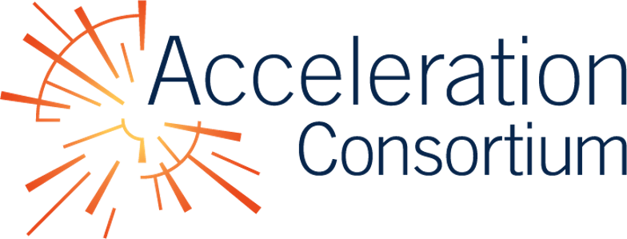
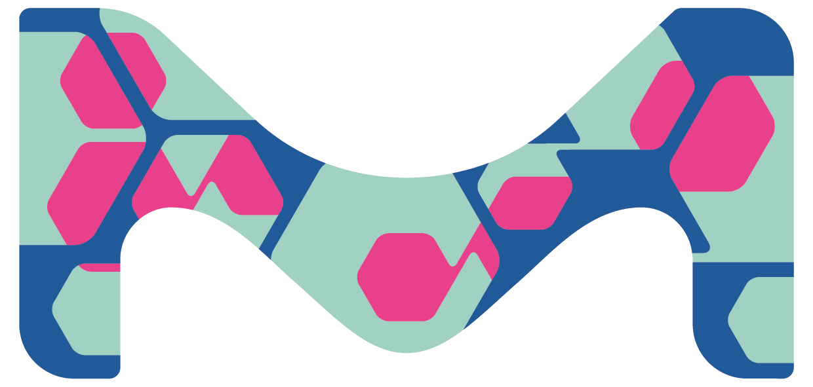

{% assign current_date = 'now' | date: "%Y-%m-%d" %}
{% assign event_start_date = site.event_start_date | date: "%Y-%m-%d" %}
{% assign event_close_date = site.event_close_date | date: "%Y-%m-%d" %}
{% assign registration_opens_date = site.registration_opens_date | date: "%Y-%m-%d" %}
{% assign registration_closes_date = site.registration_closes_date | date: "%Y-%m-%d" %}


    

    

    



    

    

    


{:.secondary}
# {{ site.event_date }}, sponsored by the Acceleration Consortium and Merck KGaA

    <h2><i class="bi bi-calendar3"></i> Event timeline</h2>
    <dl>
        
            <dt>{{ site.registration_opens_date }}</dt>
            <dd>
                Applications open for participants 
                
                    <a href="{{ site.baseurl }}" class="btn">Register now</a>
                
                    <a class="btn disabled">Registration has closed</a>
                
                    <a class="btn disabled">Registration opens soon</a>
                
            </dd>
        

        <dt>{{ site.registration_closes_date }}</dt>
        <dd>Applications close</dd>

        <dt>{{ site.event_date }}</dt>
        <dd>Hackathon date</dd>
    </dl>



With the emergence of new [Bayesian optimization tools for the physical sciences](https://chat.openai.com/share/ac610758-2ac8-4b38-8dd5-25e6c46ad2a6), it is important to understand their strengths and weaknesses, reduce the barrier to use, and adapt them for real-world problems. We will put these tools to the test! Scientists from the Acceleration Consortium and Merck KGaA are hosting a 2-day virtual hackathon on {{ site.event_date }} for researchers to work collaboratively in teams on projects related to Bayesian optimization.

Researchers can propose projects from [a range of topics](_/../projects.md) such as applying algorithms to existing benchmarks, developing new benchmark tasks, creating instructional tutorials, proposing real-world chemistry and materials optimization tasks, and more. After the hackathon, results will be collated and presented in a scholarly article.[(?)][faq]{:title="What is required for me to participate in the scholarly article?"} Join us to explore, collaborate, innovate, and contribute to the advancement of Bayesian optimization for the physical sciences! [This opportunity](_/../registration.md)
is open to researchers at all levels who are interested in Bayesian optimization[(?)][faq]{:title="Are algorithms other than Bayesian optimization allowed?"} for accelerated discovery in chemistry and materials science. Prior programming experience is not required, but for code-focused projects, we recommend beginner-to-intermediate Python programming experience and basic familiarity with git and GitHub.[(?)][faq]{:title="Am I eligible to participate in the hackathon?"}. Training and orientation resources are available on the [resources page](_/../resources.md).

## Logistics

The event will take place virtually, using a combination of **video
conferencing** ([virtual Gather space](https://app.gather.town/events/aWWEyxSfRJGgvVwT3rSA)) for meetings and seminars and **discussion forums**
([Discourse](https://accelerated-discovery.discourse.group/), [Slack](https://join.slack.com/share/enQtNjY0MDE3Njc1NjYxMS01NjJlYWJlNTY1ZDcwYTYxMTRhMTIzYTI4NDRlMmY3NzI2MjlmOGQ0NWQzY2RhZTQwMTQ4YjMxNGIwYjNiMmRj)) for ongoing comms.

<!-- [AC Discord](https://discord.gg/gZPKDH3pWU) -->

## Outputs

By the end of the event, in addition to applying and developing algorithms, benchmarks, creating tutorials, describing real-world applications, and other projects, we hope you will have formed new connections, learned new skills, and been inspired with new ideas! We will also be working towards a scholarly article[(?)][faq]{:title="What is required for me to participate in the scholarly article?"}, and we hope you will be able to contribute to this effort.



With the completion of a 2-day virtual hackathon hosted by scientists from the Acceleration Consortium and Merck KGaA on {{ site.event_date }}, we thank participants for exploring, collaborating, innovating, and contributing to the advancement of Bayesian optimization for the physical sciences.

During the hackathon, researchers had the opportunity to select or develop Bayesian optimization algorithms and apply them to benchmarking tasks, design new benchmark tasks, create instructional tutorials, describe real-world applications, and more. The results of this collaborative effort will be collated and presented in a scholarly article[(?)][faq]{:title="What is required for me to participate in the scholarly article?"}.

Although the event has concluded, the outputs from the hackathon, including applied and developed algorithms, benchmarks, and tutorials, will continue to serve as valuable resources for the research community. Outputs from teams that have opted to release their projects are available at https://github.com/AC-BO-Hackathon. We believe that through this event, new connections have been formed, new skills have been acquired, and new ideas have been inspired.

We want to express our gratitude to all the participants for their contributions, and we look forward to future collaborations in advancing Bayesian optimization in chemistry and materials science.


[faq]: {{ site.baseurl }}

<!-- ## Prizes



Tentative awards for the highest ranked projects by the judges will be announced the day after the hackathon:

First-ranked: $200 Amazon gift card for each team member
Second-ranked: $100 Amazon gift card for each team member
Third-ranked: $50 Amazon gift card for each team member

- **Best Overall** (500 CAD)
- **Best Benchmark** (200 CAD)
- **Best Algorithm** (200 CAD)
- **Best Tutorial** (200 CAD)
- **Best Presentation** (100 CAD)
- **Best Collaboration** (100 CAD)
- **Best Newcomers** (100 CAD)
- **Best Team Name** (50 CAD)
- **Best Team Spirit** (50 CAD)


We'd like to congratulate the following teams for their outstanding contributions to the hackathon:

- **Best Overall**: Team 1 (500 CAD)
- **Best Benchmark**: Team 2 (200 CAD)
- **Best Algorithm**: Team 3 (200 CAD)
- **Best Tutorial**: Team 4 (200 CAD)
- **Best Presentation**: Team 5 (100 CAD)
- **Best Collaboration**: Team 6 (100 CAD)
- **Best Newcomers**: Team 7 (100 CAD)
- **Best Team Name**: Team 8 (50 CAD)
- **Best Team Spirit**: Team 9 (50 CAD)
 -->

<!-- ## Sponsors

- [The Acceleration Consortium @ University of Toronto](https://acceleration.utoronto.ca/)
- [Merck KGaA](https://www.emdgroup.com/en) -->

## Sponsors

    
    

