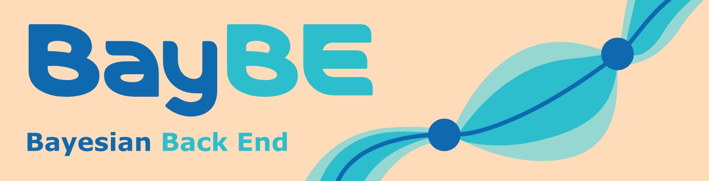

<ul class="grid">

<li class="resource-block" markdown="1">

## Getting Started

#### [Slack](https://join.slack.com/share/enQtNjY0MDE3Njc1NjYxMS01NjJlYWJlNTY1ZDcwYTYxMTRhMTIzYTI4NDRlMmY3NzI2MjlmOGQ0NWQzY2RhZTQwMTQ4YjMxNGIwYjNiMmRj) - Join the hackathon's Slack channel to connect, ask questions, and form teams

#### [Project proposals](_/../submission.md) - team leaders should submit their project proposals using the instructions here

#### [Gather](https://app.gather.town/events/aWWEyxSfRJGgvVwT3rSA) - Add the event to your calendar

####  [Accelerated discovery forum](https://accelerated-discovery.discourse.group/) - create an account to join the discussion forums

#### [Bayesian optimization](https://youtu.be/IVaWl2tL06c) - Watch the Accelerate '23 training workshop on Bayesian optimization



</li>

<li class="resource-block" markdown="1">

## Orientation Modules

Please complete the following orientation assignments in preparation for the hackathon to familiarize the tools and concepts you'll need. You will need to [create a GitHub account](https://github.com/join) to access these resources. If you are already familiar with git and GitHub, you may skip directly to "Intro to GitHub Classroom".

<table>
    <tr>
        <td><a href="https://classroom.github.com/a/2rswOlPi">📝 Intro to Git and GitHub</a></td>
        <td><a href="https://classroom.github.com/a/EaTuZ8L8">📝 Intro to GitHub Classroom</a></td>
    </tr>
</table>

For those looking for a refresher on Python programming or to implement a simple BO example, see the following GitHub Classroom assignments:

<table>
    <tr>
        <td><a href="https://classroom.github.com/a/XFCJVXYP">📝 Python Refresher</a></td>
        <td><a href="https://classroom.github.com/a/TlzXth_g">📝 Simple Bayesian optimization script</a></td>
    </tr>
</table>



</li>

<li class="resource-block" markdown="1">

## Bayesian optimization

#### [Bayes Rule by 3Blue1Brown](https://youtu.be/HZGCoVF3YvM) -- explanation of the fundamental concept behind Bayesian methods



#### [A Visual Exploration of Gaussian Processes](https://distill.pub/2019/visual-exploration-gaussian-processes/) - A Distill Pub article explaining a commonly used predictive model in Bayesian optimization with visualizations and mathematical rigor.

#### [Exploring Bayesian Optimization](https://distill.pub/2020/bayesian-optimization/) - A Distill Pub article that provides an overview of active learning, Bayesian optimization with visualizations and mathematical rigor.

#### [Bayesian Optimization Book](https://bayesoptbook.com/) - For those REALLY looking to dive deep into the topic, this book is a comprehensive resource on Bayesian optimization. The book aims to provide a self-contained and comprehensive introduction to Bayesian optimization, starting "from scratch" and carefully developing all the key ideas along the way. The book is free, and even open-source.

</li>

<li class="resource-block" markdown="1">

## Python

Programming expertise is not required, but at least beginner Python programming experience is recommended for participation in code-focused projects of the hackathon. For those looking for a brief, interactive refresher on Python programming, see the GitHub Classroom assignment from the first section on this page. For those without prior Python experience, we recommend you complete an introductory Python course in preparation for the hackathon. Some resources are listed below:

<table>
    <tr>
        <td><a href="https://www.coursera.org/specializations/python">Python for Everybody by University of Michigan</a></td>
        <td><a href="https://www.codecademy.com/learn/learn-python-3">Learn Python 3 by CodeAcademy</a></td>
    </tr>
    <tr>
        <td><a href="https://youtube.com/playlist?list=PLL0SWcFqypCmkHClksnGlab3wglEVMqNN">Intro to Python Programming for Materials Engineers</a></td>
        <td><a href="https://wiki.python.org/moin/BeginnersGuide/Programmers">Python Beginners Guide for Programmers by Python Software Foundation</a></td>
    </tr>
</table>

If you have no prior programming experience, you may wish to start with the [Python Beginners Guide for Non-programmers by Python Software Foundation](https://www.python.org/about/gettingstarted/).

</li>

<li class="resource-block" markdown="1">

## BO Tools

Use of the tools listed on this page is not a requirement. A diverse set of packages and implementations is encouraged. Likewise, multiple teams using the same package is not a problem, in part because implementations can remain private during the course of the hackathon.[(?)][faq]{:title="Does my GitHub repository need to be public?"} If you'd like to see a specific tool listed here, please navigate to the "Improve this page" link at the bottom of the page and open a pull request. See also the [Acceleration Consortium's curated list of optimization tools](https://github.com/AccelerationConsortium/awesome-self-driving-labs#optimization).

</li>

<li class="resource-block" markdown="1">

#### BayBE

This hackathon is co-organized by Merck KGaA. You may consider using an internal Merck tool that was recently open-sourced, called the [Bayesian optimization BackEnd (BayBE)](https://github.com/emdgroup/baybe). This tool focuses on real-world experimental campaigns in the physical sciences with support for integrating domain knowledge through custom parameter encodings and built-in chemical encodings. In addition, it allows for custom surrogate models, mixed variable types, and transfer learning.

</li>

<li class="resource-block" markdown="1">

#### Adaptive Experiment (Ax) Platform

The [Ax Platform](https://ax.dev/) is a tool developed by Meta's Adaptive Experimentation team. It is a user-friendly, modular, and actively developed general-purpose Bayesian optimization platform with support for simple and advanced optimization tasks. It is a high-level wrapper to the widely used [BoTorch](https://botorch.org/) library, also developed by Meta, which is built on PyTorch.

</li>

<li class="resource-block" markdown="1">

#### Honegumi: An interactive BO teaching tool

[Honegumi](https://honegumi.readthedocs.io/en/latest/) (pronounced "ho neh goo mee", also referred to as "honey gummy"), deriving from the Japanese word for _skeletal framework_, is a package for interactively creating API tutorials with a focus on optimization packages. You use an interactive grid to select Bayesian optimization characteristics specific to your task and watch template dynamically appear. "Open in Colab" and "Open in GitHub" links are also dynamically generated for each template. [Honegumi pairs particularly well with LLMs](https://youtu.be/rnI2BvGgP9o) to adapt the templates to real-world tasks.

</li>

<li class="resource-block" markdown="1">

## Guidelines

### [Submission](_/../resources/submission.md) - The hackathon's workflow for submissions

</li>

</ul>

[faq]: {{ site.baseurl }}