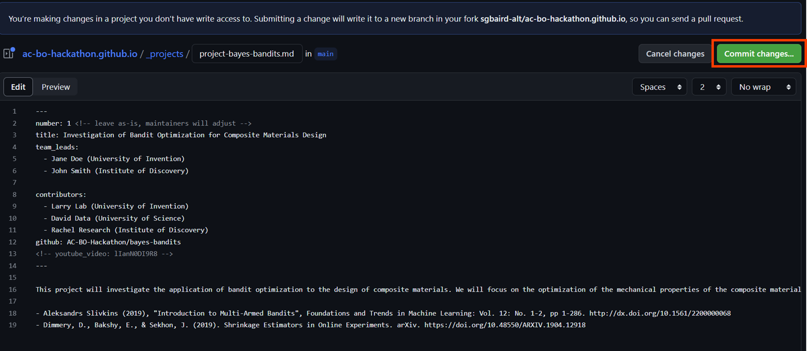

Start by reviewing the topics below.

## Topics

While a list of topics is provided, we are open to new ideas. If you have a project in mind that doesn't fit into one of the topics below, you are welcome and encouraged to submit a project proposal for it.

### Applying Algorithms to Benchmark Tasks

We will provide a set of benchmark tasks and instructions, and your job will be to choose a package or algorithm and apply it to task(s) of your choice. The tasks will cover a broad range of both optimization complexity and application domains.

#### Benchmark Tasks

We are still refining the list of benchmark tasks. Please contact us if you have suggestions for existing optimization benchmark datasets or tasks that you would like to see included.

##### Domain

- Analytical functions
- Molecule Optimization
- Materials Optimization

##### Optimization features

- Multi-fidelity Optimization
- Constrained Optimization
- Multi-objective Optimization
- Real-world noise

### Developing New Benchmarks

Ideally, these tasks will be representative of real-world problems in chemistry and materials science. While remotely accessible automated experiments would be the gold standard, the more pragmatic benchmark tasks typically include surrogate modeling. The new benchmark tasks should lean towards real-world conditions in terms of optimization problem type (objectives, fidelities, constraints) and/or relevance towards chemistry and materials applications (e.g., molecules, materials, reactions, etc.).

### Creating Instructional Tutorials

We will provide a set of topics in Bayesian optimization, and your job will be to create a tutorial that introduces the topic conceptually and provides a hands-on example. These are meant to be "gentle introduction" tutorials which assume beginner Python knowledge and Bayesian optimization knowledge (see [resources](_/../resources.md) for more details).

### Real-world Chemistry and Materials Tasks

The hackathon is also open to proposals for real-world optimization tasks in chemistry and materials science. This will involve providing beginner-friendly background knowledge on the impact of the application, existing solutions, and the science behind it. It will also involve providing rigorous details around the optimization problem, including search space (tunable parameters + constraints), objectives, experimental equipment, reagants, and standard operating procedures. These should be well-defined problems that *can* and *should* be tackled with Bayesian optimization, but have not yet. If you do not have a background in Bayesian optimization, it is highly recommended that you watch the recording of the Accelerate '23 [Gentle Introduction to Bayesian Optimization](https://youtu.be/IVaWl2tL06c) training workshop.

### General

This category is for projects that don't fit into the special topics listed above, but generally fall within the topic of Bayesian optimization for the physical sciences.

## Project initialization

As a teamleader, to initialize your project(s)[<sup>(?)</sup>][faq]{:title="Can I participate in multiple projects?"}, please follow these steps:

1. Use [this link to create a new file](https://github.com/AC-BO-Hackathon/ac-bo-hackathon.github.io/new/main/_projects) in a fork of the hackathon repository named `project-<your-team-name>.md`. For example, if your team name is "Bayes Bandits", the file should be named `project-bayes-bandits.md`



1. Copy the template from below into the file and fill in the title, team leads, and contributors sections
2. Submit a pull request to the hackathon repository with the title "Add project <your-team-name>" and tag your team members in the pull request description
3. Once the pull request is merged, your project will appear on [the projects page](_/../../projects.md)

Replace `<your-repo-name>` with the GitHub repository that was created by GitHub Classroom for you. For example, if your team name is "Bayes Bandits", the repository will be named `bayes-bandits`, and the `github` field should be `AC-BO-Hackathon/bayes-bandits`.
5. Accept the GitHub Classroom invitation to a topic above
6. Create a new team in the GitHub Classroom interface
7. Have your team members click on the same GitHub Classroom invitation link that you used and join the team you created.

```markdown
---
number: 1 <!-- leave as-is, maintainers will adjust -->
title: Project 1 title
team_leads:
  - Project lead 1 (Institution 1)
  - Project lead 2 (Institution 2)

# Comment these lines to hide these elements
contributors:
  - Contributor 1 (Institution 1)
  - Contributor 2 (Institution 2)
github: AC-BO-Hackathon/<your-repo-name>
<!-- youtube_video: lIanN0DI9R8 -->
---

Project 1 description

- References here
- ...
```

Here is an example of a filled-in project file called `project-bayes-bandits.md` for the "Bayes Bandits" team:

```markdown
---
number: 1 <!-- leave as-is, maintainers will adjust -->
title: Investigation of Bandit Optimization for Composite Materials Design
team_leads:
  - Jane Doe (University of Invention)
  - John Smith (Institute of Discovery)

contributors:
  - Larry Lab (University of Invention)
  - David Data (University of Science)
  - Rachel Research (Institute of Discovery)
github: AC-BO-Hackathon/bayes-bandits
<!-- youtube_video: lIanN0DI9R8 -->
---

This project will investigate the application of bandit optimization to the design of composite materials. We will focus on the optimization of the mechanical properties of the composite materials, such as strength, stiffness, and toughness as a function of the fiber types and matrix materials. We will compare the performance of bandit optimization with the performance of Bayesian optimization using featurization tactics for this highly discrete space.

- Aleksandrs Slivkins (2019), "Introduction to Multi-Armed Bandits", Foundations and Trends in Machine Learning: Vol. 12: No. 1-2, pp 1-286. http://dx.doi.org/10.1561/2200000068
- Dimmery, D., Bakshy, E., & Sekhon, J. (2019). Shrinkage Estimators in Online Experiments. arXiv. https://doi.org/10.48550/ARXIV.1904.12918
```

If the submission instructions from above are daunting, you are welcome to submit your project proposal by email to sterling.baird@utoronto.ca. Please include "AC BO Hackathon Project Proposal" in the subject line. We will create the project file and corresponding pull request for you.

## End of hackathon

To ensure a dynamic and engaging submission process, we ask that all hackathon teams submit their final projects through social media (e.g., Twitter, LinkedIn, YouTube). By sharing your work with a broader audience, you’ll help to promote groundbreaking research in materials science and chemistry while inspiring others to contribute to the field.

Here are the guidelines for submitting your project:

1. Create a concise video presentation (2 minutes or less) summarizing your team’s project, highlighting its applications in materials science and chemistry, and showcasing your project outputs.

2. Post your video to YouTube (unlisted is fine) and submit a pull request to update your project file with the YouTube video ID (e.g., `IVaWl2tL06c` for `https://youtu.be/IVaWl2tL06c`). For example, you would replace the following two lines:

```markdown
github: AC-BO-Hackathon/bayes-bandits
<!-- youtube_video: lIanN0DI9R8 -->
```
with:
```
github: AC-BO-Hackathon/bayes-bandits
youtube_video: IVaWl2tL06c
```

If you don't want to post it to YouTube, you can also post it directly to LinkedIn or Twitter. In this case, please update the project description file to include a link to the post and create a new pull request. For example, if your description is:

```markdown
This project will investigate the application of bandit optimization to the design of composite materials. We will focus on the optimization of the mechanical properties of the composite materials, such as strength, stiffness, and toughness as a function of the fiber types and matrix materials. We will compare the performance of bandit optimization with the performance of Bayesian optimization using featurization tactics for this highly discrete space.

- Aleksandrs Slivkins (2019), "Introduction to Multi-Armed Bandits", Foundations and Trends in Machine Learning: Vol. 12: No. 1-2, pp 1-286. http://dx.doi.org/10.1561/2200000068
- Dimmery, D., Bakshy, E., & Sekhon, J. (2019). Shrinkage Estimators in Online Experiments. arXiv. https://doi.org/10.48550/ARXIV.1904.12918
```

You could add a link before the references (replace `<your_link_here>` with your actual link, without the angle brackets):

```markdown
This project will investigate the application of bandit optimization to the design of composite materials. We will focus on the optimization of the mechanical properties of the composite materials, such as strength, stiffness, and toughness as a function of the fiber types and matrix materials. We will compare the performance of bandit optimization with the performance of Bayesian optimization using featurization tactics for this highly discrete space.

See also the [LinkedIn submission post](<your link here>).

- Aleksandrs Slivkins (2019), "Introduction to Multi-Armed Bandits", Foundations and Trends in Machine Learning: Vol. 12: No. 1-2, pp 1-286. http://dx.doi.org/10.1561/2200000068
- Dimmery, D., Bakshy, E., & Sekhon, J. (2019). Shrinkage Estimators in Online Experiments. arXiv. https://doi.org/10.48550/ARXIV.1904.12918
```

This pull request will be considered your final submission. Again, if you find this process daunting, you are welcome to instead send your link by email to sterling.baird@utoronto.ca. Please include "AC BO Hackathon Final Submission" in the subject line. We will update the project file and create corresponding pull request for you.

[faq]: {{ site.baseurl }}